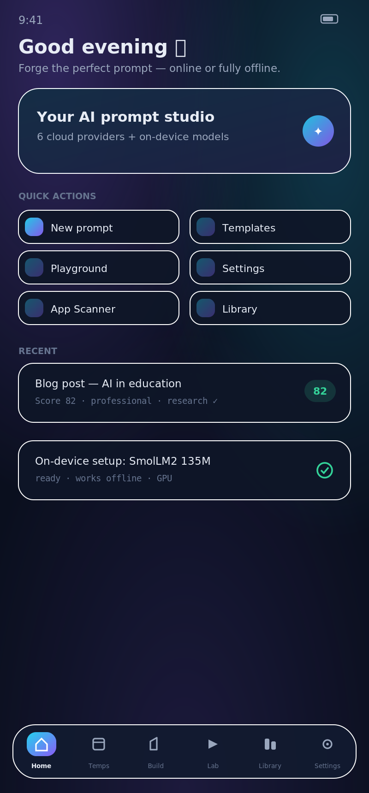
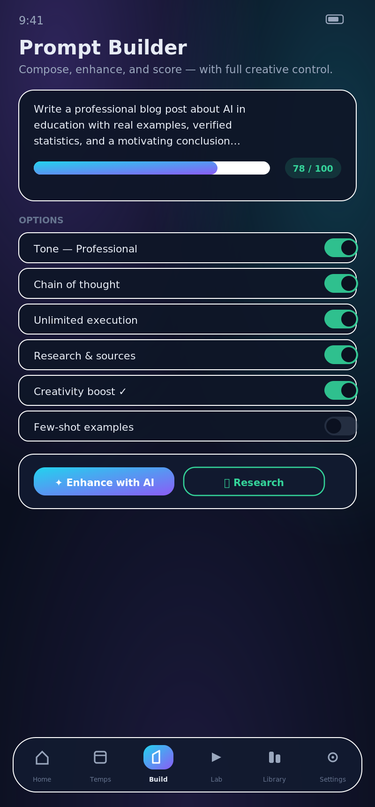
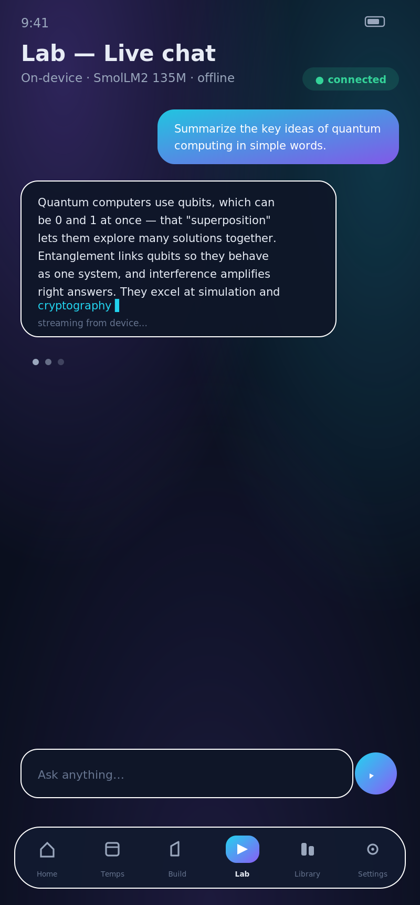
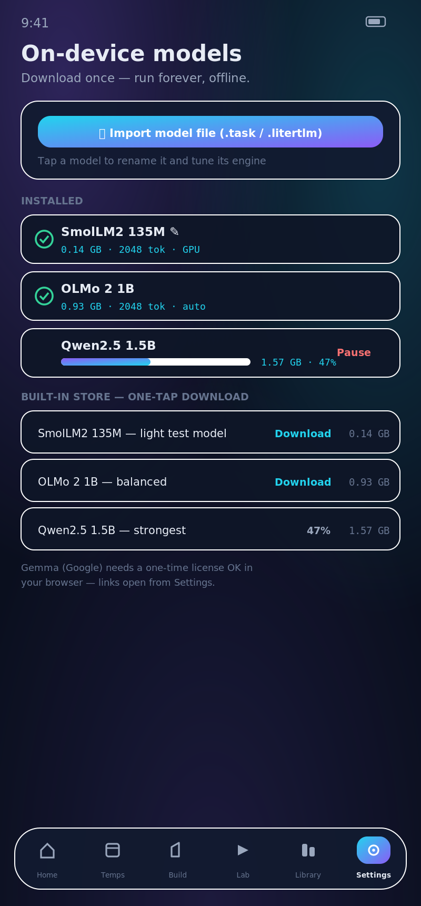

<div align="center">


# 🔥 PromptForge — برومبت فورج

**The on-device AI prompt studio — professional prompt engineering, entirely from your phone.**

**استوديو الأوامر بالذكاء الاصطناعي — هندسة أوامر احترافية من هاتفك بالكامل، حتى بلا إنترنت.**

[](LICENSE)
[]()
[]()
[]()
[]()

</div>

---

<div align="center">

| | |
|:---:|:---:|
|  |  |
| **Home — quick actions & score** | **Builder — enhance, research, creativity** |
|  |  |
| **Lab — live streaming chat, fully offline** | **On-device models — store, editor, downloads** |

</div>

---

## 🇬🇧 English

### ✨ What is PromptForge?

A professional **AI prompt-engineering studio** that runs **entirely on your phone**:
build prompts with a guided builder, boost them with AI, verify them with research
directives, score their quality live — and **execute them with LLMs running on the
device itself**, with no computer and no internet at all.

### 🚀 Highlights

| | |
|---|---|
| 🧠 **On-device LLMs** | Run GGUF-class models via **Google AI Edge (MediaPipe GenAI)** — stream answers with the phone fully offline |
| 🛒 **Built-in model store** | One-tap downloads (SmolLM2 135M · OLMo 2 1B · Qwen2.5 1.5B) with **status-bar progress notifications, pause/resume, auto-resume after interruption, and true background operation** via a foreground service |
| 🛠️ **Model editor** | Tap any installed model to **rename it** and tune its engine: max output tokens (up to 8192), top-K diversity, GPU/CPU engine — **no artificial limits** |
| ✍️ **Pro builder** | AI enhance, research pack with citation rules, **creativity-boost directives**, unlimited-execution directives, unlimited custom sections, live 0–100 scoring |
| 🎚️ **Creativity dial** | Temperature 0 → 1.5 with one-tap presets (**Precise / Balanced / Creative / Wild**) and live bilingual hints |
| 🔍 **App Scanner** | Pick any installed app → facts are extracted locally (permissions, versions, install source) → your phone's own AI writes a **deep, comprehensive audit report** with a 0–100 trust score |
| 🧪 **Lab** | Live streaming chat with any provider or on-device model; edit & resend, regenerate, copy |
| ☁️ **6 cloud providers** | Gemini · Groq · OpenRouter · Mistral · Cerebras · Ollama (LAN) — graceful 429 handling, auto model switching |
| 🔔 **Background work** | Foreground service + wake locks: downloads and on-device tasks keep running when you leave the app |
| 🌍 **Bilingual** | Full Arabic/English UI with instant switch + system-language detection |
| 🛡️ **Private by design** | No accounts, no analytics, no tracking — keys and models stay on the device |

### 📲 Install

Grab the latest APK from [**Releases**](../../releases) and install it directly
(allow "install from unknown sources" when prompted).

### 🧠 On-device models in 3 steps

1. **Settings → On-device** → pick a model from the built-in store → one-tap download
2. When the download completes the model **activates automatically**
3. Open the **Lab** and chat — it now works **fully offline**

> Google's Gemma models require accepting their license in a browser first;
> the app links to them with a clear note (they are gated, unlike the store models).

### 🛠️ Build from source

```bash
# Requirements: JDK 17, Android SDK (compileSdk 36), Gradle 8.x
git clone https://github.com/zeiad6/PromptForge.git
cd PromptForge
echo "sdk.dir=/path/to/android-sdk" > local.properties
./gradlew :app:assembleRelease
# APK → app/build/outputs/apk/release/
```

### 🏗️ Tech stack

Kotlin 2.x · Jetpack Compose Material 3 · MediaPipe tasks-genai 0.10.35 ·
DataStore · OkHttp/Retrofit · Coroutines & StateFlow · IBM Plex Sans Arabic (OFL)

---

## 🇾🇪 العربية

### ✨ ما هو برومبت فورج؟

استوديو احترافي **لهندسة أوامر الذكاء الاصطناعي** يعمل **بالكامل داخل هاتفك**:
ابنِ أمرك بالبانئ الموجّه، عزّزه بالذكاء الاصطناعي، تحقّق منه بوضع البحث والتوثيق،
قِس جودته لحظياً — ثم **نفّذه بموديلات تعمل داخل الجهاز نفسه**، بلا حاسوب وبلا إنترنت إطلاقاً.

### 🚀 أبرز المميزات

| | |
|---|---|
| 🧠 **موديلات على الجهاز** | شغّل موديلات LLM عبر **Google AI Edge** — إجابات متدفقة والهاتف **أوفلاين تماماً** |
| 🛒 **متجر موديلات مدمج** | تنزيل بنقرة واحدة (سمول إل‌إم 135M · أولمو 2 1B · كوين 2.5 1.5B) مع **إشعار تقدم في شريط الحالة، إيقاف/استكمال، استكمال تلقائي بعد الانقطاع، وعمل حقيقي في الخلفية** |
| 🛠️ **محرر الموديلات** | اضغط أي موديل مثبّت لـ**إعادة تسميته** وضبط محركه: حد المخرجات (حتى 8192 توكن)، التنوع top-K، المحرك GPU/CPU — **بلا أي قيود اصطناعية** |
| ✍️ **بانئ احترافي** | تعزيز بالذكاء الاصطناعي، حزمة بحث بقواعد توثيق، **توجيهات تعزيز الإبداع**، توجيهات تنفيذ بلا حدود، أقسام مخصصة غير محدودة، تقييم لحظي 0–100 |
| 🎚️ **مقبض الإبداع** | حرارة من 0 إلى 1.5 مع مستويات بنقرة واحدة (**دقيق / متوازن / إبداعي / جامح**) ووصف حي |
| 🔍 **فاحص التطبيقات** | اختر أي تطبيق مثبّت ← تُستخرج حقائقه محلياً (الأذونات، الإصدارات، مصدر التثبيت) ← يكتب ذكاء هاتفك **تقرير تدقيق عميقاً وشاملاً** بدرجة ثقة من 100 |
| 🧪 **المختبر** | محادثة حية متدفقة مع أي مزوّد أو موديل محلي؛ تحرير وإعادة إرسال، تجديد، نسخ |
| ☁️ **6 مزودين سحابيين** | Gemini · Groq · OpenRouter · Mistral · Cerebras · Ollama (شبكة محلية) — معالجة أنيقة لـ429 وتبديل تلقائي للموديل |
| 🔔 **العمل في الخلفية** | خدمة أمامية + أقفال استيقاظ: التنزيلات والمهام تكمل وأنت في أي تطبيق آخر |
| 🌍 **ثنائي اللغة** | واجهة عربية/إنجليزية كاملة بتبديل فوري وكشف لغة النظام |
| 🛡️ **خصوصية بالتصميم** | بلا حسابات، بلا تتبع، بلا تحليلات — المفاتيح والموديلات تبقى في جهازك |

### 📲 التثبيت

حمّل أحدث APK من صفحة [**Releases**](../../releases) وثبّته مباشرة
(فعّل «التثبيت من مصادر غير معروفة» عند السؤال).

### 🧠 الموديلات المحلية في 3 خطوات

1. **الإعدادات ← على الجهاز** ← اختر موديلاً من المتجر المدمج ← تنزيل بنقرة
2. عند اكتمال التنزيل يُ**فعَّل الموديل تلقائياً**
3. افتح **المختبر** وتحدث — أصبح يعمل **أوفلاين بالكامل**

> موديلات Gemma من Google تتطلب قبول الترخيص من المتصفح أولاً؛
> التطبيق يوفر روابطها مع تنبيه واضح (لأنها محمية، بخلاف موديلات المتجر).

### 🛠️ البناء من المصدر

```bash
# المتطلبات: JDK 17، حزمة Android SDK (compileSdk 36)، Gradle 8.x
git clone https://github.com/zeiad6/PromptForge.git
cd PromptForge
echo "sdk.dir=/path/to/android-sdk" > local.properties
./gradlew :app:assembleRelease
# ملف APK → app/build/outputs/apk/release/
```

---

## 📄 License — الترخيص

This project is source-available for **personal use only** under the
[Personal Use License](LICENSE):

هذا المشروع متاح المصدر **للاستخدام الشخصي فقط** بموجب [رخصة الاستخدام الشخصي](LICENSE):

- ✅ **Personal**: use, study, modify for yourself, share unmodified copies
- ✅ **شخصي**: الاستخدام والدراسة والتعديل الخاص ومشاركة نسخ غير معدّلة
- ❌ **Commercial use strictly prohibited** — selling, paid services, or any revenue-generating use
- ❌ **الاستخدام التجاري ممنوع منعاً باتاً** — البيع أو الخدمات المدفوعة أو أي استغلال ربحي
- ©️ **All rights reserved by the author**, including reserved **patent rights** on its mechanisms and inventions — no patent rights are granted
- ©️ **جميع الحقوق محفوظة للمطوّر**، بما فيها حقوق **براءة الاختراع** المحفوظة على آلياته وابتكاراته — لا تُمنح أي حقوق براءة

---

<div align="center">

## 👨‍💻 Author — المطوّر

**زياد الحمادي — Ziyad Al-Hamadi**

📞 ‎+967 784 908 515 · ✉️ z30432981@gmail.com

*Made with ❤️ in Yemen — صُنع بحب في اليمن 🇾🇪*

</div>
